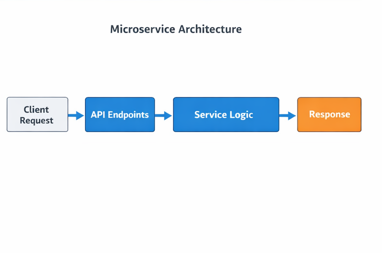

# Clean Microservice Demo

## Overview
A modular FastAPI microservice demonstrating clean software architecture, minimal unit testing, and reproducible service design. Highlights software engineering principles for MSc-level applications.

## Architecture


**Description:**  
- Client → API Endpoints → Service Logic → In-Memory Storage → Response  

## Experimental / Methodology Setup
- REST API endpoints with Pydantic data validation  
- In-memory database for state persistence  
- Minimal unit tests included for functional verification  

## Outcomes
- Showcases software engineering principles and system architecture  
- Demonstrates readiness for MSc-level applied software projects  

## Literature / Research Context
- Exemplifies modular service-oriented design  
- Reinforces reproducibility and test-driven development in software engineering  

## PDF Summary
A concise 1-page summary is included:  
[CleanMicroservice.pdf](CleanMicroservice.pdf)

## Future Work
- Extend microservice to include persistent database storage  
- Add additional service endpoints and inter-service communication  
- Integrate with other microservices for full-stack deployment  

## Installation / Usage
```bash
# Start FastAPI server
uvicorn app:app --reload

# Test endpoint
curl http://127.0.0.1:8000/items

## Evaluation & Validation
The system logic is validated using lightweight unit tests to ensure correctness
of core behavioral inference and API functionality, following standard
software engineering and experimental prototyping practices.


Note: This project was primarily developed offline. The full project was uploaded to GitHub upon completion, which may result in commit dates appearing close together. The commit history does not reflect the actual development timeline.